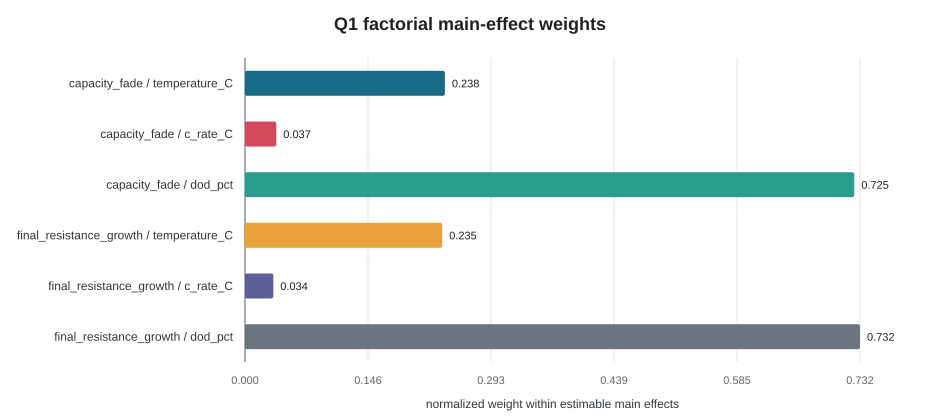
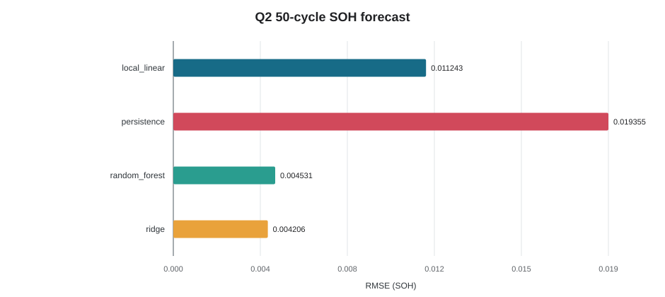
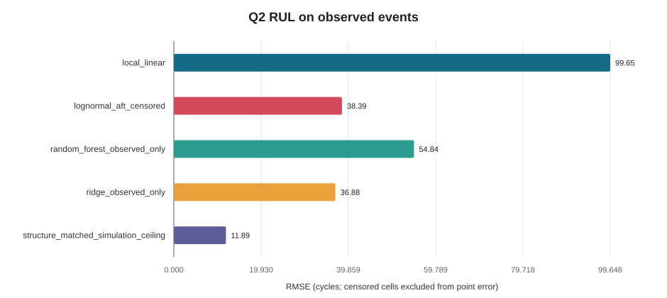
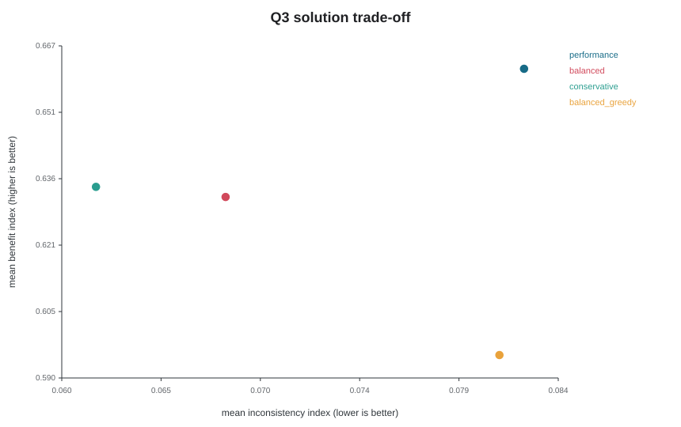
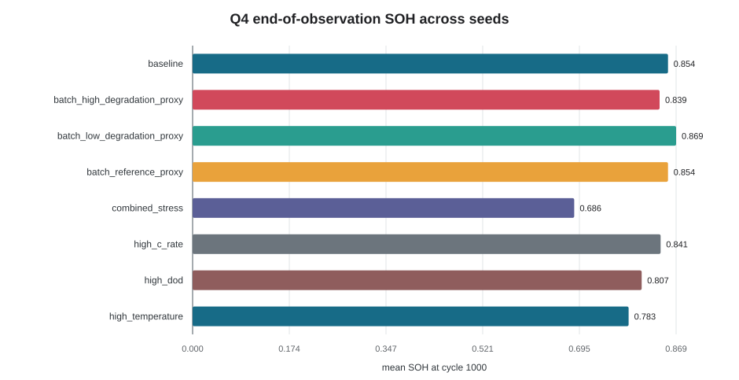

# A题最小可运行技术文档

> 版本：`A_NMC_G2_G4_v1`。本文件由 `battery_study` 固定配置生成，面向论文写作。
> 运行：`PYTHONPATH=code python -m battery_study.cli --config configs/study_pipeline.json --out study_output`
> 验证：`python -m pytest code/tests -q`；产物哈希见 `study_output/run_manifest.json`。

标记约定：`[CONFIRMED]` 已由题面、代码或可复跑结果确定；`[RESULT]` 本次仿真结果；`[ASSUMED]` 自设假设；`[UPDATEABLE]` 有真实数据或评分细则后应更新；`[UNCERTAIN]` 当前证据不能确定；`[OOD/ABSTAIN]` 禁止数值外推。

## 一、假设

1. `[CONFIRMED]` 主对象为 NMC（LiNiMnCo/graphite），G1 仅以 CALCE INR18650-20R 作为尺度与方向参考；本研究没有读取或拟合 CALCE 原始循环数据，108 颗电芯均为合成仿真。
2. `[ASSUMED][UPDATEABLE]` 容量与内阻共享分段平方根退化量：`L(e)=sqrt(min(e,n_k))+2 max(0,sqrt(e)-sqrt(n_k))`；`alpha`、`beta`、温度/倍率/DOD 加速系数、噪声和个体差异均来自 G0 假设台账。
3. `[CONFIRMED]` 支持域限定为 25--50 degC、0.5--2C、DOD 50--100%、CC-CV；低温、过充、过放及 >2C 均标记 `[OOD/ABSTAIN]`。
4. `[ASSUMED][UPDATEABLE]` 80% SOH 仅作 RUL 终点和“临界阶段”建模阈值，不等同普适安全阈值；Q3 的筛选门槛和无量纲成本收益权重也不是行业标准。
5. `[CONFIRMED]` 同一 `cell_id` 的全部循环只进入同一交叉验证折；RUL 未在 1000 cycles 前到达阈值时按右删失处理。
6. `[UNCERTAIN]` 真实批次分布、真实成本、安全失效概率及范围外工况缺数据，当前不能从仿真确定。

## 二、模型

### 2.1 退化阶段与因素权重

`[ASSUMED][UPDATEABLE]` 正常阶段定义为 SOH 高于 0.8 且在检测膝点前；退化阶段为 SOH 高于 0.8 且在膝点后；临界阶段为 SOH 不高于 0.8。膝点在 `sqrt(EFC)` 坐标上用连续 hinge 回归检测。DOD=50% 时 1000 cycles 只覆盖 500 EFC，膝点按右删失而非强行估计。

因素权重采用平衡 `3 x 3 x 3` 全因子边际 sum-of-squares。`normalized_main_effect_weight` 只在温度、倍率、DOD 三个可辨识主效应内归一化；交互项和电芯差异保留为剩余方差。cycle/EFC 是老化轴，不伪装成随机因素；协议只有 CC-CV 一个水平，协议效应不可辨识。

### 2.2 SOH 与 RUL

`[CONFIRMED]` 当前 SOH 由近期容量中位数与初期容量中位数之比估计。50-cycle SOH 比较 persistence、局部线性、Ridge 和 Random Forest；外层使用 `GroupKFold(cell_id)`，另做 27 个 leave-condition-out 压力测试。

`[CONFIRMED]` RUL 在 cycle=300 landmark 建模。主模型为右删失 log-normal AFT：`log(T)=beta^T x + sigma epsilon`；事件样本用密度似然，删失样本用生存概率。名义 90% 区间再用训练事件的 0.99 绝对对数残差分位作保守膨胀，外层事件覆盖率仍原样报告。Ridge/RF 只用可观测失效训练，属于删失朴素对照。结构匹配模型从 landmark 前 `sqrt(EFC)` 轨迹反演寿命，只是仿真同构上界。

### 2.3 筛选与编组

`[ASSUMED][UPDATEABLE]` cycle=750 构造退役候选池，硬门槛为 SOH、RUL 90% 区间下界、内阻增长和寿命区间宽度。兼容组固定 4 颗，以容量、SOH、RUL、内阻离散度度量不一致性。

MILP 使用候选组二元变量 `x_g`：每颗电芯 `sum_{g contains i} x_g <= 1`，并要求 `sum_g x_g = 8`。目标最大化归一化收益，最小化不一致、风险和无量纲成本。性能、平衡、保守三套权重与 greedy 基线共同报告；不输出人民币收益。

### 2.4 鲁棒性与弃权

`[CONFIRMED]` 在支持域内比较 baseline、高温、高倍率、高 DOD 和组合压力；用 5 个新 seed 做 Monte Carlo，并对 7 个参数作 +/-10% OAT。`[ASSUMED][UPDATEABLE]` 批次差异由 +/-10% 退化参数偏移和更高个体差异代理，不是实测批次分布。

## 三、实验

### 3.1 设计与可复现性

- `[CONFIRMED]` 全因子：3 温度 x 3 倍率 x 3 DOD x 4 电芯 = 108 电芯、108000 行、每芯 1000 cycles。
- `[CONFIRMED]` 预测外层 5 折按电芯留组；bootstrap 以电芯为重采样单位，报告 90% 区间。
- `[CONFIRMED]` 43 颗电芯在观测窗内达到 80% SOH，65 颗为右删失；点误差只在 43 个可观测事件上计算。
- `[CONFIRMED]` Q4 训练 seed 为 20260811，鲁棒性 seed 为 42、123、2026、4096、8110。

### 3.2 Q1 结果

`[RESULT]` 对 72 颗观测到膝点的电芯，检测膝点相对生成器设定的中位绝对误差为 13.40 EFC；36 颗为右删失。该值只证明实现能恢复自身结构，不是外部有效性证据。

容量衰减主效应：

| 因素 | 主效应内归一化权重 | 总方差占比 |
|---|---:|---:|
| temperature_C | 0.2378 | 0.2289 |
| c_rate_C | 0.0373 | 0.0359 |
| dod_pct | 0.7249 | 0.6979 |

内阻增长主效应：

| 因素 | 主效应内归一化权重 | 总方差占比 |
|---|---:|---:|
| temperature_C | 0.2346 | 0.2264 |
| c_rate_C | 0.0337 | 0.0325 |
| dod_pct | 0.7317 | 0.7060 |

### 3.3 Q2 结果

50-cycle SOH 留组预测：

| 模型 | MAE | RMSE | R2 | RMSE 90% cell-bootstrap CI |
|---|---:|---:|---:|---:|
| ridge | 0.003345 | 0.004206 | 0.9936 | 0.003962--0.004447 |
| random_forest | 0.003583 | 0.004531 | 0.9925 | 0.004303--0.004761 |
| local_linear | 0.009982 | 0.011243 | 0.9541 | 0.010731--0.011752 |
| persistence | 0.018056 | 0.019355 | 0.8640 | 0.018463--0.020227 |

`[RESULT]` 通用模型中 RMSE 最低的是 `ridge`（RMSE=0.004206）。`[RESULT]` 删失感知 AFT 在 43 个可观测事件上的 RUL RMSE=38.39 cycles，名义 90% 事件区间覆盖率=0.9070，对 65 个删失样本的提前失效矛盾率=0.0000。结构匹配仿真上界 RMSE=11.89 cycles，但不得用于真实泛化宣称。

### 3.4 Q3 结果

`[RESULT]` 108 颗退役候选中 85 颗通过假设门槛，筛选率=0.7870；共生成 3167 个兼容候选组。三套 MILP 均选出 8 组，重复分配为 0，错误组规模为 0。平衡 MILP 目标=1.2048，同权重 greedy=1.0828。

### 3.5 Q4 结果

| 场景 | cycle=1000 平均 SOH | 临界比例 | Ridge SOH RMSE | 筛选率 |
|---|---:|---:|---:|---:|
| baseline | 0.8541 | 0.0000 | 0.003756 | 1.0000 |
| batch_high_degradation_proxy | 0.8391 | 0.0000 | 0.004615 | 1.0000 |
| batch_low_degradation_proxy | 0.8687 | 0.0000 | 0.004218 | 1.0000 |
| batch_reference_proxy | 0.8541 | 0.0000 | 0.003756 | 1.0000 |
| combined_stress | 0.6857 | 1.0000 | 0.004608 | 0.0000 |
| high_c_rate | 0.8409 | 0.0000 | 0.003876 | 1.0000 |
| high_dod | 0.8069 | 0.1917 | 0.004034 | 1.0000 |
| high_temperature | 0.7833 | 0.9667 | 0.003959 | 0.9167 |

`[RESULT]` 上表仅描述支持域内仿真。低温、过充、过放和 3C 的 `numeric_prediction` 均为空；这些场景只输出 `[OOD/ABSTAIN]`，不能用趋势图补造数值。

## 四、结论

1. `[RESULT]` 在本全因子仿真内，温度、倍率和 DOD 对容量衰减/内阻增长的相对作用可由上表量化；CC-CV 因无对照水平不可给权重。该排序是条件范围内结论，不是普适机理排序。
2. `[RESULT]` 50-cycle SOH 的留组实验显示线性/集成模型优于 persistence；AFT 能利用右删失信息并避免把寿命下界当真值。`[UNCERTAIN]` 没有真实独立电池数据，因此不能把误差数字写成实车精度。
3. `[RESULT]` 风险门槛 + MILP 能产生满足组规模和唯一分配约束的方案，并在平衡权重下优于 greedy。`[ASSUMED][UPDATEABLE]` 门槛、权重、成本和收益必须随真实检测/商业数据更新。
4. `[RESULT]` 高温、组合压力和假设高退化批次降低 SOH 或可筛选性；工程动作只能表述为“本仿真条件下触发复检/拒绝强制编组”。
5. `[OOD/ABSTAIN]` 对支持域外温度、倍率、DOD 或充电协议，不输出寿命、安全性或收益数值。

论文可直接使用的数字以 `study_output/*.csv` 和 `run_manifest.json` 为唯一事实源。任何真实数据替换都必须重新运行全流水线，并同步更新 `[ASSUMED]/[UPDATEABLE]/[UNCERTAIN]` 标记。
